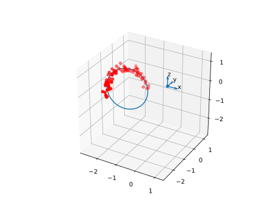

Introduction
------------

This package allows to compute the best fit circle given points in three-dimensional space.

Installation
------------

The package can be installed with pip.

.. code-block:: bash

   $ pip install circle-fitting-3d
   

Example Usage
-------------

>>> from circle_fitting_3d import Circle3D

>>> circle_3d = Circle3D([[3, 0, 0], [0, 3, 0], [0, 0, 3]])

>>> circle_3d.center
Point([1., 1., 1.])

>>> circle_3d.radius
2.449489742783178

The circle and points can be plotted as follows (plot created using the `example_1.py` script located in the `examples` folder):

>>> import matplotlib.pyplot as plt
>>> fig = plt.figure()
>>> ax = fig.add_subplot(111, projection="3d")
>>> circle_3d.plot(ax)

Acknowledgment
--------------
This package is based on the scikit-spatial_ library by Andrew Hynes and the algorithm is based on the algorithm provided by the MESHLOGIC_ webiste.

.. _scikit-spatial: https://github.com/ajhynes7/scikit-spatial
.. _MESHLOGIC: https://meshlogic.github.io/posts/jupyter/curve-fitting/fitting-a-circle-to-cluster-of-3d-points/